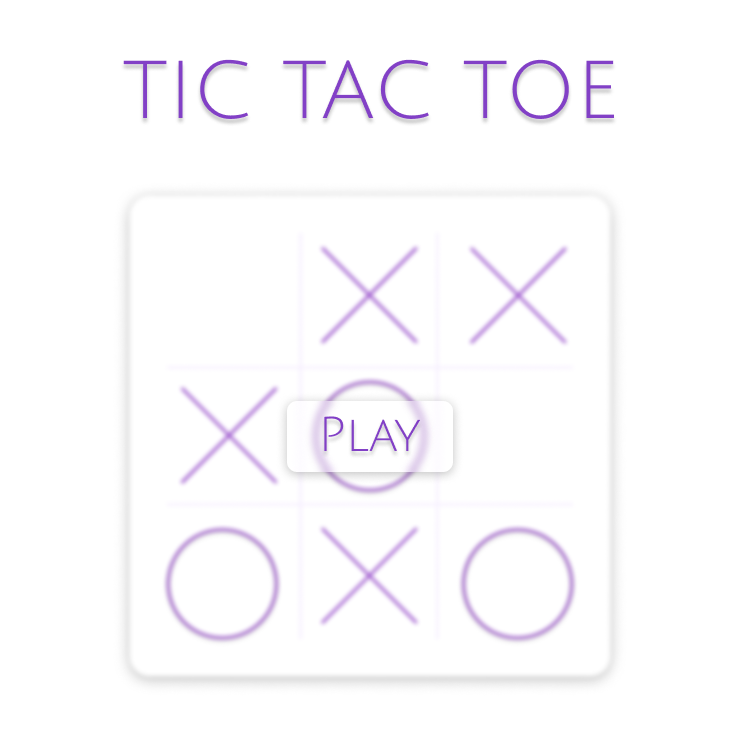
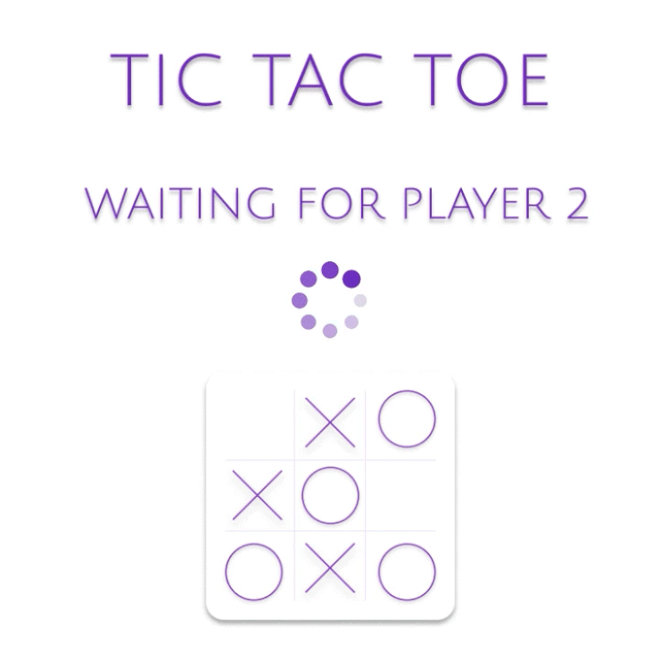
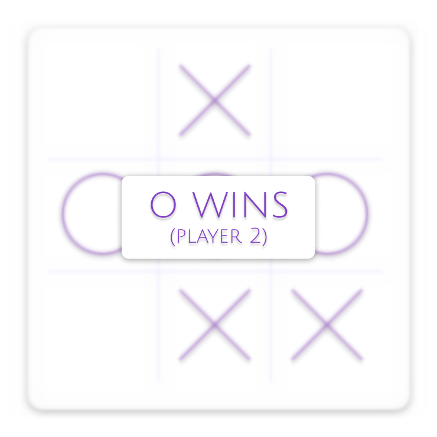

<br>
<div align="center">
  <p>
    
  </p>

# 🐍 A Python multiplayer tic-tac-toe using sockets 🕹

</div>

<p align="center">
  
  
  <a href="https://github.com/abacaxiguy" target="_blank"></a>
</p>

<br>

<p align="center">
  
  
  
  
  
</p>

---

## 📋 About

As a final project for the discipline of Computer Networks, we were asked to develop a multiplayer application using sockets. We chose to develop a tic-tac-toe game, which is a simple game, but it was a great challenge to develop it using sockets.

Here is the report as requested by the teacher (in portuguese): [Relatório](./relatorio.pdf)

---

## 🚀 Usage

To run this project locally, you'll need to have [Python](https://www.python.org/downloads/) installed on your machine. With that, you can clone this repository and install the dependencies.

```sh
  # Clone this repository
  git clone
```

After cloning the repository, you'll need to install the dependencies. To do that, run the following commands:

```sh
  # Creating a virtual environment
  python3 -m venv env # or python -m venv env, depending on your operating system

  # Activating the virtual environment
  . env/bin/activate # or env/Scripts/activate, depending on your operating system

  # Installing the dependencies
  pip install -r requirements.txt
```

With the dependencies installed, you'll need to start the socket server. To do that, run the following command:

```sh
  # Starting the socket server
  python server.py # remember to have the virtual environment activated
```

As default, the server will be running on port 5000. If you want to change that, you can do it by changing in the `server.py` file. After starting the server, you can start the GUI. To do that, run the following command:

```sh
  # Starting the GUI
  python main.py # remember to have the virtual environment activated
```

✨ Now your client is running! Your opponent can do the same in their machine at the same network and you can play together! (or you can open two terminals and run the client twice if you don't have a friend 😔)

---

## 🤝 Contributing

Contributions, issues and feature requests are welcome!
Feel free to check [issues page](https://github.com/abacaxiguy/tictactoe/issues).

---

## 📜 License

Copyright © 2023 [João Lucas](https://github.com/abacaxiguy) 🤝 [Iasmin Borba](https://github.com/IasminBorba) 🤝 [José Alexandre](https://github.com/ZanderAlec) 🤝 [Jhordan Lacerda](https://github.com/IIVader)<br />
This project is licensed under the [MIT](https://github.com/abacaxiguy/tictactoe/blob/main/LICENSE) license.

---

## 👩‍💻 Developers

| [<br><sub>João Lucas</sub>](https://github.com/abacaxiguy) | [<br><sub>Iasmin Borba</sub>](https://github.com/IasminBorba) | [<br><sub>José Alexandre</sub>](https://github.com/ZanderAlec) | [<br><sub>Jhordan Lacerda</sub>](https://github.com/IIVader) |
| :---------------------------------------------------------------------------------------------------------------: | :-------------------------------------------------------------------------------------------------------------------: | :-------------------------------------------------------------------------------------------------------------------: | :--------------------------------------------------------------------------------------------------------------: |
